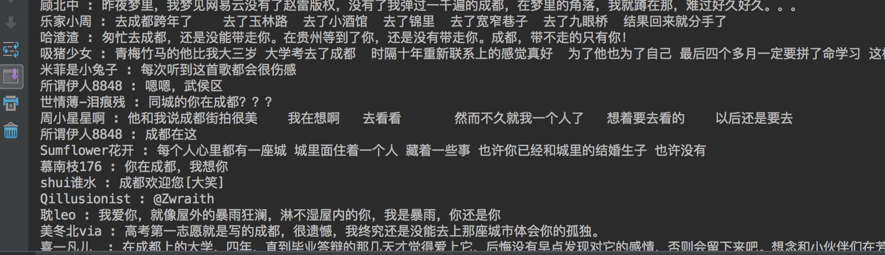

# 网易云音乐评论抓取

**简介:**
根据网易云音乐的歌曲id获取相应的评论

##安装
* 安装python的pycrypto模块

```
$ sudo pip install pycrypto
```

* 安装pymysql模块

```
$ sudo pip install pymysql
```
## 配置
* 在settings.py中配置自己的数据库信息

```
database_params = {
    "host": '',
    "port": '',
    "user": '',
    "password": '',
    "db": ''
}
```

## 使用说明

**1** 输入需要获取数据的歌曲id，例如```436514312```为赵雷的成都歌曲id
**2** 输入要获取的评论页数 **具体使用如下,example.py:**

```
	# 音乐的id
    music_id = "436514312"
    url = base_url % music_id
    # 得到第一页到第五页的评论内容
    msg = get_comments(url, from_page=1, to_page=5)
    # 下面就是输出用户名和用户评论内容的例子
    example_print_user_and_content(msg)
```

**3** 具体的逻辑处理，可以在data_process.py文件中增加方法，db文件中已经写好了数据库的驱动方法，直接配置参数调用sql语句即可

## 运行结果
* 下面是example.py的运行结果:


